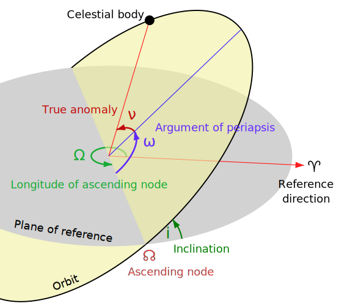

# Orbital Elements

## The 6 Orbital Elements

1. Eccentricity: Defines the shape of an ellipse. 0 is perfect circle, 1 is a parabola. Rep: `e`.

2. Semi-major Axis: The farthest distance from the centre of the ellipse. Also half the sum of the periapsis and apoapsis. Rep: `α`.

3. Inclination: The vertical tilt of the ellipse to the reference plane. Rep: `i`.

4. Ascending Node: Where the ellipse intersects upwards through the reference plane. Usually given as a longitude coordinate. The Longitude (angle) is represented as `Ω`.

5. Argument of periapsis: The orientation of the ellipse around the orbital plane, measured from the ascending node to the periapsis. Rep: `ω`.

6. True anomaly: The position of the body on the ellipse, in degrees. Rep: `ν` or `θ`.

## Other Terminology
1. Epoch: the position of the body at t=0.

2. Period: The time it takes for the body to complete one orbit.
3. Apoapsis/Apogee: Furthest distance from orbiting body.

4. Periapsis/Perigee: Closes distance to orbiting body.

6. Semi-minor axis: Closest distance to the centre of the orbital ellipse.

7. Mean Anomaly: A fictitious 'angle' that represents the fraction of the period passed of the body in orbit. Has no geometric representation.

8. Primary body: The massive body.

9. Secondary body: The satellite.

10. Geocentric Equatorial Coordinate System: A non-rotating coordinate system that uses the sun as a reference. It's commonly used for describing satellite positions.

11. Vernal Equinox: A line joining the centre of the Earth and the sun. This direction defines the positive X basis vector for the GEC.

12. Eccentric Anomaly: The angle formed at the centre of the ellipse between the perigee and a point on the auxiliary circle found by projecting the point of the secondary body. Similar to True Anomaly, but the angle is a the centre of the ellipse, not the primary body. It's a pain to calculate as Kepler's equation is transcendental. Below, $E$ is the eccentric anomaly, $M$ is the mean anomaly, and $e$ is the eccentricity.  
$$ M = E - e\sin{E}$$

## Kepler's Laws
His three Laws for describing a body in orbit around a more massive body (in his case, it was the planets around the sun).

1. The orbit of a secondary body is an ellipse with the primary body at one of the two foci.

2. A line segment joining a secondary and primary body sweeps out equal areas during equal intervals of time.

3. The square of a secondary body's orbital period is proportional to the cube of the length of the semi-major axis of its orbit.

## Further Reading
[Up-to-date ISS data (all 6 minus True Anomaly).](https://www.heavens-above.com/orbit.aspx?satid=25544)  
[Past ISS data.](https://in-the-sky.org/spacecraft_elements.php?id=25544)  
[Good page on Orbital Elements.](https://www.astronomicalreturns.com/p/section-43-six-orbital-elements.html)
